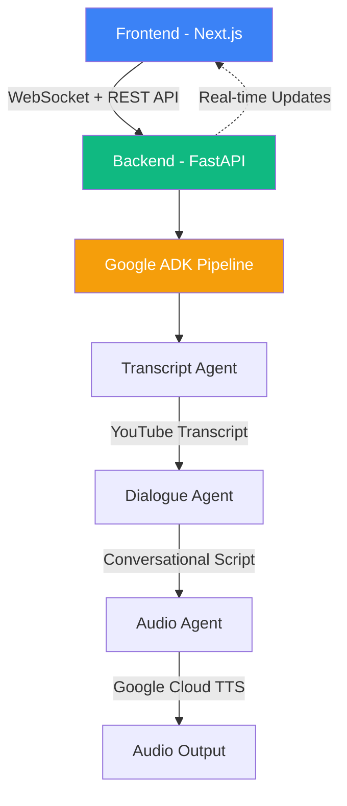

# 🎙️ Podcast Digest Agent

Transform any YouTube podcast into an AI-powered conversational audio summary using Google's latest AI technologies.


## 🎯 Overview

Podcast Digest Agent is a full-stack application that leverages Google's Agent Development Kit (ADK) to create engaging audio summaries from YouTube videos. The system uses a pipeline of specialized AI agents to fetch transcripts, generate summaries, and produce natural conversational audio with dual voices that sound like a real podcast discussion.

## 🏗️ Architecture



## 🚀 Tech Stack

### Backend
- **FastAPI** - Modern async Python web framework
- **Google ADK v1.0.0** - Official Google Agent Development Kit
- **Gemini 2.0 Flash** - Google's low cost/fast inference
- **Google Cloud TTS** - Text-to-speech with Chirp HD voices
- **Pydantic v2** - Data validation and serialization

### Frontend  
- **Next.js 15** - React framework with App Router
- **TypeScript** - Type-safe development
- **shadcn/ui** - Modern UI components
- **TanStack Query** - Data fetching and caching
- **Motion.dev** - Smooth animations

### Infrastructure
- **Google Cloud Run** - Serverless container hosting with auto-scaling
- **Vercel** - Frontend deployment with edge functions
- **Cloud NAT + Static IP** - Reliable outbound connections for proxy
- **Webshare Proxy** - Bypass YouTube restrictions on cloud IPs

## ✨ Key Features

- **Real-time Processing Visualization** - Watch AI agents work in real-time via WebSocket
- **Dual-Voice Conversations** - Natural dialogue between two AI hosts
- **Smart Rate Limiting** - User-friendly rate limiting with countdown timers and clear feedback
- **Production Proxy System** - Reliable YouTube access with automatic rotation
- **Type-Safe Architecture** - Full TypeScript + Pydantic validation
- **Async Processing** - Concurrent audio generation for performance

## 🛠️ Installation & Setup

### Prerequisites
- Python 3.11+
- Node.js 18+
- Google Cloud account with APIs enabled
- Webshare proxy credentials (optional)

### Backend Setup
```bash
# Clone repository
git clone https://github.com/yourusername/podcast-digest-agent.git
cd podcast-digest-agent

# Navigate to server directory
cd server

# Create virtual environment
python -m venv venv
source venv/bin/activate  # Windows: venv\Scripts\activate

# Install dependencies
pip install -r requirements.txt

# Set up environment variables
cp .env.example .env
# Edit .env with your credentials

# Run backend
python src/main.py
```

### Frontend Setup
```bash
# From project root
cd client
npm install
npm run dev
```

## 🔧 Configuration

### Required Environment Variables

Create a `.env` file in the root directory:

```env
# Google AI Configuration
GOOGLE_API_KEY=your-gemini-api-key
GOOGLE_APPLICATION_CREDENTIALS=path/to/service-account.json

# Proxy Configuration (Required for production)
PROXY_ENABLED=true
PROXY_TYPE=webshare
WEBSHARE_PROXY_USERNAME=your-username
WEBSHARE_PROXY_PASSWORD=your-password

# For production on Cloud Run
GOOGLE_GENAI_USE_VERTEXAI=TRUE
GOOGLE_CLOUD_PROJECT=your-project-id
GOOGLE_CLOUD_LOCATION=us-central1
```

For the frontend, create `client/.env.local`:
```env
NEXT_PUBLIC_API_URL=http://localhost:8000  # Backend URL
```

## 📚 Documentation

- [Architecture Overview](docs/ARCHITECTURE.md)
- [API Documentation](docs/API.md)


## 🧪 Testing

```bash
# Backend tests
pytest tests/ --cov=src

# Frontend tests  
cd client
npm run test

# Test rate limiting
curl -X POST http://localhost:8000/api/v1/test_rate_limit \
  -H "Content-Type: application/json" \
  -d '{"url": "https://youtube.com/watch?v=test"}'
```

## 🛡️ Rate Limiting

The application includes intelligent rate limiting to ensure fair usage:

- **Main Processing**: 10 requests per hour per IP address
- **Test Endpoint**: 3 requests per minute (for development testing)
- **User Experience**: Live countdown timers and clear feedback when limits are reached
- **Auto-Reset**: Limits reset automatically using sliding window algorithm

When rate limited, users see:
- Clear error messages explaining the limit
- Countdown timer showing when they can try again
- Exact reset time for transparency

## 📦 Deployment

### Backend Deployment (Google Cloud Run)

1. **Deploy to Cloud Run:**
```bash
cd server
gcloud run deploy podcast-digest-agent \
  --source . \
  --region us-central1 \
  --platform managed \
  --allow-unauthenticated
```

2. **Configure environment variables in Cloud Run console**

3. **Set up Static IP (Required for proxy):**
   - Reserve a static IP address
   - Create VPC network with Cloud NAT
   - Configure Cloud Run to use Direct VPC egress
   - Whitelist the static IP in your proxy provider

### Frontend Deployment (Vercel)

1. **Deploy with Vercel CLI:**
```bash
cd client
vercel deploy --prod
```

2. **Set environment variable in Vercel:**
   - `NEXT_PUBLIC_API_URL`: Your Cloud Run backend URL

## 🤝 Contributing

Contributions are welcome! Please feel free to submit a Pull Request.

1. Fork the repository
2. Create your feature branch (`git checkout -b feature/AmazingFeature`)
3. Commit your changes (`git commit -m 'Add some AmazingFeature'`)
4. Push to the branch (`git push origin feature/AmazingFeature`)
5. Open a Pull Request

## 📄 License

This project is licensed under the MIT License - see the [LICENSE](LICENSE) file for details.

## 🙏 Acknowledgments

- Built with [Google Agent Development Kit (ADK)](https://github.com/google/adk)
- UI components from [shadcn/ui](https://ui.shadcn.com/)
- Animations powered by [Motion.dev](https://motion.dev/)
- Proxy service by [Webshare](https://www.webshare.io/)

## ⚠️ Important Notes

- **YouTube Access**: Production deployments require a proxy service as YouTube blocks cloud provider IPs
- **API Keys**: Never commit API keys or credentials to the repository
- **Rate Limits**: The app implements rate limiting (10 requests/hour) to prevent abuse
- **Costs**: Running on Google Cloud incurs costs for Cloud Run, Cloud NAT, and API usage

---

Made with ❤️ by the Podcast Digest Team
