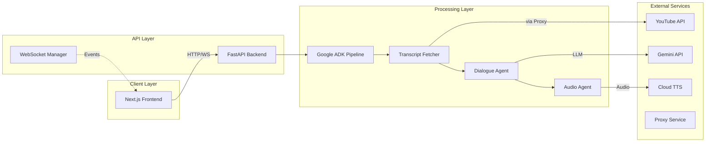
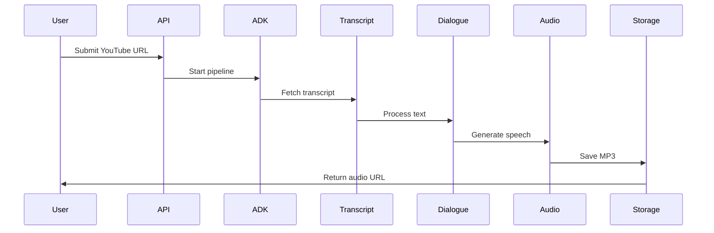
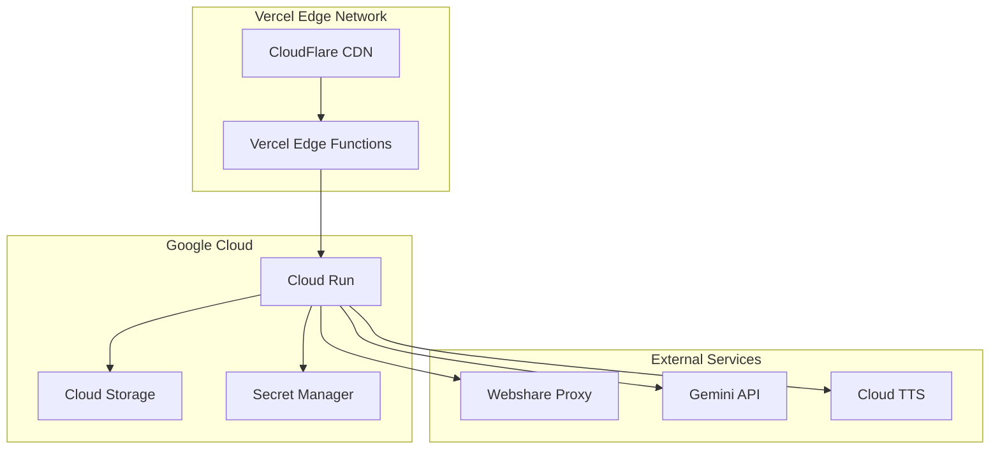

# Architecture Overview

## System Design

The Podcast Digest Agent uses a modular monolithic architecture with clear separation of concerns:

### Component Overview



### Data Flow

1. **Request Phase**: User submits YouTube URL
2. **Transcript Phase**: ADK fetches transcript via proxy  
3. **Processing Phase**: Gemini generates conversational summary
4. **Audio Phase**: Cloud TTS creates dual-voice audio
5. **Delivery Phase**: Audio URL returned to user

### Key Design Decisions

- **ADK Integration**: Leverages Google's official agent framework for reliability
- **Async Processing**: Non-blocking architecture for scalability
- **WebSocket Updates**: Real-time progress without polling
- **Proxy Rotation**: Ensures reliable YouTube access
- **Type Safety**: Pydantic + TypeScript for runtime validation

## Technical Stack

### Backend Architecture

```
server/
├── src/
│   ├── adk_agents/          # Google ADK agent implementations
│   │   ├── podcast_agent.py         # Main orchestrator agent
│   │   └── podcast_agent_sequential.py  # Sequential processing
│   │
│   ├── adk_runners/         # ADK pipeline execution
│   │   ├── pipeline_runner.py       # Main ADK runner
│   │   └── websocket_bridge.py      # ADK-WebSocket bridge
│   │
│   ├── adk_tools/           # ADK-compatible tools
│   │   ├── audio_tools.py           # Audio generation
│   │   └── transcript_tools.py      # Transcript fetching
│   │
│   ├── api/v1/              # REST API endpoints
│   │   ├── endpoints/
│   │   │   ├── audio.py             # Audio serving
│   │   │   ├── config.py            # Config endpoint
│   │   │   └── tasks.py             # Task management + rate limiting
│   │   └── router.py                # API router
│   │
│   ├── config/              # Configuration
│   │   ├── settings.py              # Pydantic settings
│   │   ├── logging_config.py        # Logging setup
│   │   └── proxy_config.py          # Proxy configuration
│   │
│   ├── core/                # Core services
│   │   ├── connection_manager.py    # WebSocket connections
│   │   └── task_manager.py          # Task state management
│   │
│   └── models/              # Data models
│       └── api_models.py            # Pydantic schemas
```

### Frontend Architecture

```
client/
├── src/
│   ├── app/                 # Next.js App Router
│   │   ├── layout.tsx               # Root layout
│   │   └── page.tsx                 # Home page
│   │
│   ├── components/          # React components
│   │   ├── Hero/                    # Landing components
│   │   ├── Process/                 # Processing UI
│   │   ├── Layout/                  # Layout components
│   │   └── ui/                      # shadcn/ui components + RateLimitNotice
│   │
│   ├── contexts/            # State management
│   │   └── WorkflowContext.tsx      # Processing state
│   │
│   ├── lib/                 # Utilities
│   │   ├── api-client.ts            # API communication
│   │   └── websocket-manager.ts     # WebSocket client
│   │
│   └── types/               # TypeScript definitions
│       ├── api-types.ts             # API schemas
│       └── workflow.ts              # Workflow types
```

## Key Components

### Google ADK Integration

The system leverages Google's Agent Development Kit (ADK) v1.0.0 for:

- **Agent Orchestration**: Sequential execution of processing steps
- **Event System**: Real-time progress tracking
- **Session Management**: State persistence across agents
- **Error Handling**: Automatic retries and graceful degradation

### WebSocket Architecture

Real-time updates flow through a sophisticated WebSocket system:

1. **ADK Events** → **WebSocket Bridge** → **Connection Manager** → **Client**
2. Each task has a dedicated WebSocket room for isolation
3. Automatic reconnection with exponential backoff
4. Event deduplication to prevent duplicate updates

### Audio Processing Pipeline



### Security & Performance

- **Proxy Rotation**: Webshare residential proxies for YouTube access
- **Smart Rate Limiting**: IP-based sliding window with user-friendly feedback
- **CORS**: Strict origin validation
- **Caching**: Audio files cached for 24 hours
- **Async Processing**: Non-blocking I/O throughout

## Deployment Architecture

### Production Environment



### Scaling Strategy

- **Frontend**: Vercel automatic scaling with edge caching
- **Backend**: Cloud Run auto-scaling (0-100 instances)
- **Audio Storage**: Google Cloud Storage with CDN
- **Database**: Future consideration for task persistence

## Development Workflow

### Local Development

1. **Backend**: FastAPI with hot reload on port 8000
2. **Frontend**: Next.js with Turbopack on port 3000
3. **Proxy**: Optional local proxy for testing

### CI/CD Pipeline

1. **Pre-commit**: Code quality checks (Black, Ruff, MyPy)
2. **Testing**: Pytest with 85%+ coverage requirement
3. **Build**: Docker multi-stage builds
4. **Deploy**: Automated via GitHub Actions

### Monitoring & Observability

- **Logging**: Structured JSON logs with correlation IDs
- **Metrics**: Cloud Run built-in metrics
- **Tracing**: Future OpenTelemetry integration
- **Alerts**: Cloud Monitoring for error rates


