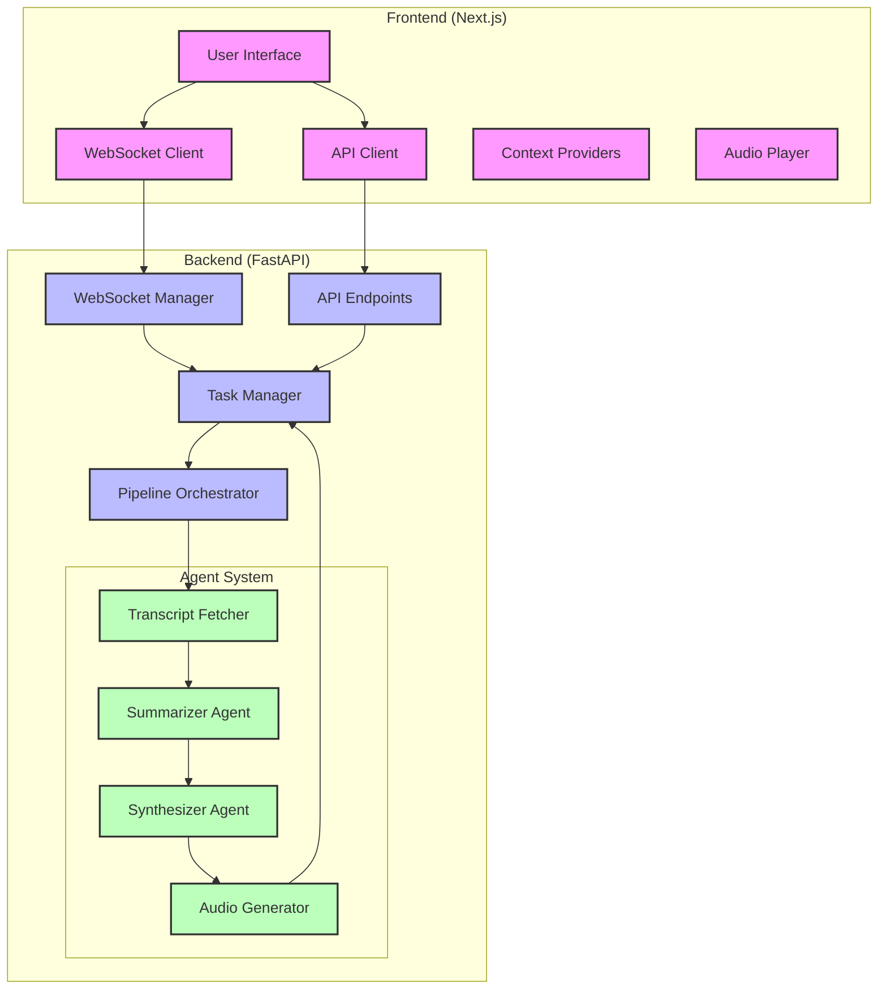
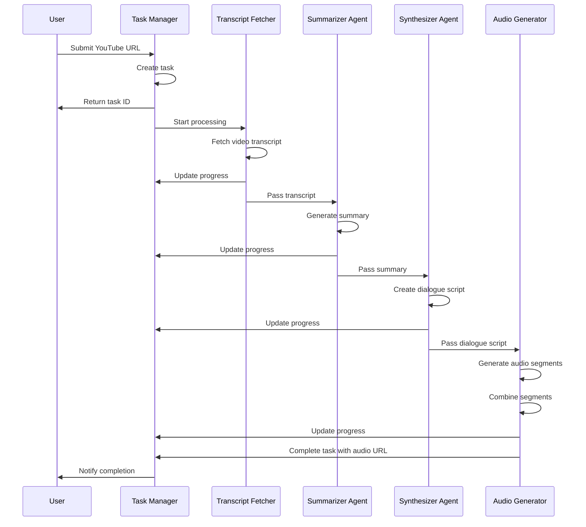
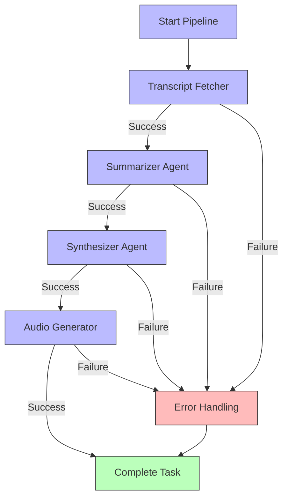
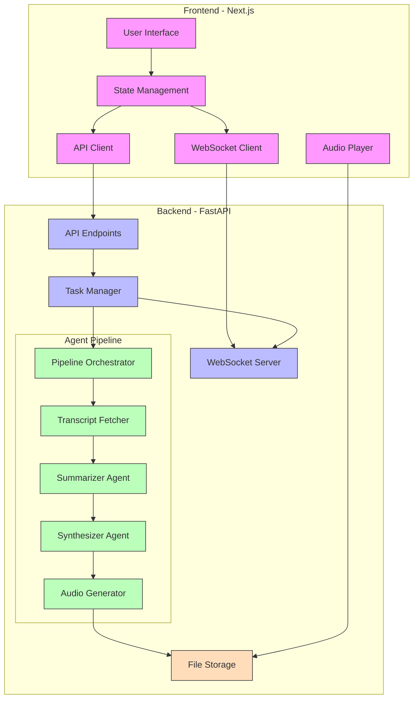
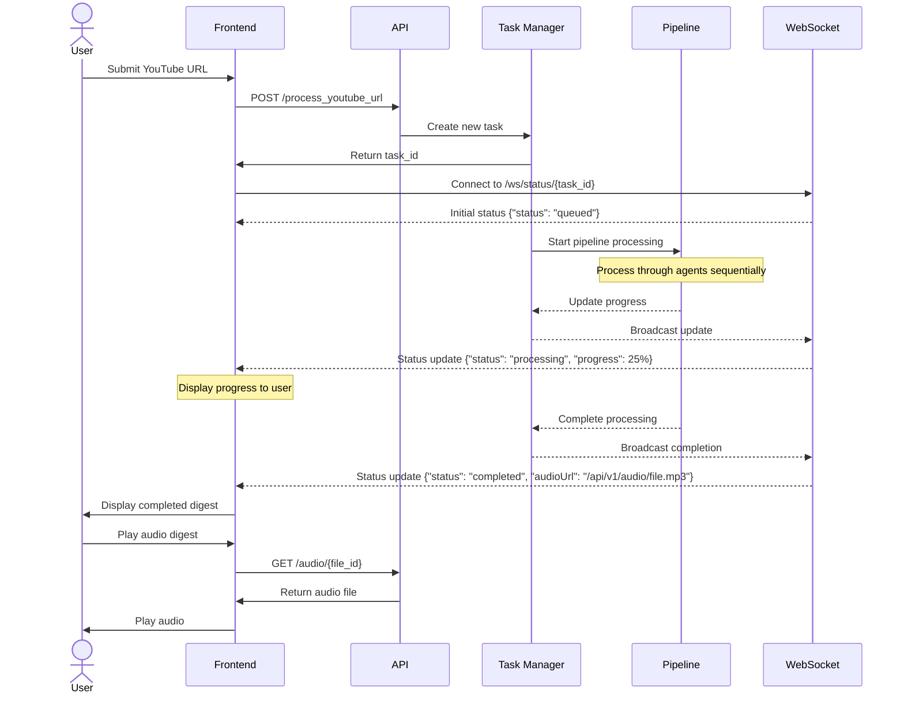
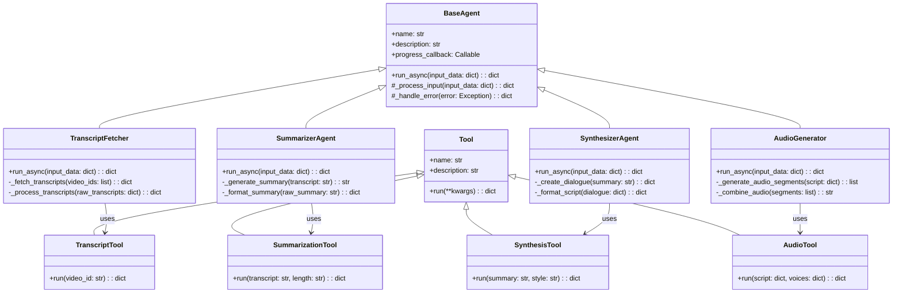
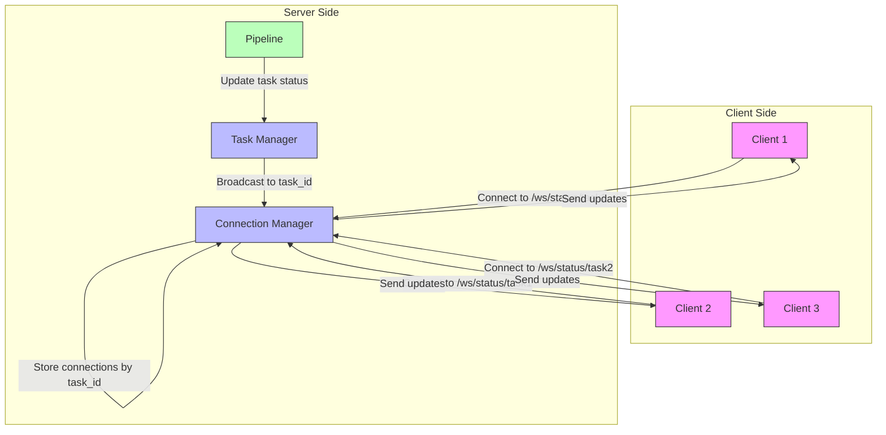

# 📚 75% COMPLETED - Documentation Plan

**Current Status**: Core documentation exists but needs comprehensive updates and new sections.

## Completion Status

✅ **README.md (90%)**: Comprehensive project overview with badges, architecture diagrams, and setup instructions
✅ **API Documentation (100%)**: Generated via FastAPI's automatic OpenAPI docs at `/docs`
⚠️ **Architecture Documentation (50%)**: Basic architecture exists, needs detailed system diagrams
⚠️ **Setup/Development Guide (60%)**: Exists in README, needs dedicated detailed guides
❌ **User Guide (0%)**: No user-facing documentation exists
❌ **Deployment Guide (0%)**: No deployment documentation exists
⚠️ **Contributing Guidelines (30%)**: Basic guidelines in README, needs detailed contributing.md

## Outstanding Items

**High Priority:**
1. Create dedicated `docs/setup.md` with detailed installation steps
2. Create `docs/user_guide.md` for end users
3. Create `docs/deployment.md` for production deployment
4. Add Mermaid diagrams to visualize system architecture
5. Create `docs/contributing.md` with development guidelines

**Medium Priority:**
6. Create `docs/development.md` with coding standards and workflow
7. Add API client documentation and examples
8. Create troubleshooting guides
9. Add performance optimization documentation

**Low Priority:**
10. Set up documentation versioning
11. Create automated documentation checks
12. Add video tutorials/walkthroughs

## Overview

This specification outlines a comprehensive documentation plan for the Podcast Digest Agent project. High-quality documentation is essential for developer onboarding, knowledge sharing, maintenance, and future extensions of the project.

## Goals

1. Create comprehensive, accurate, and maintainable documentation
2. Provide clear instructions for setup, development, and deployment
3. Document API endpoints and their usage
4. Explain the architecture and component interactions
5. Create user guides for non-technical users
6. Establish documentation standards and processes

## Implementation Details

### 1. README.md Update

The project README should serve as the entry point for all documentation. Update it to include:

```markdown
# Podcast Digest Agent


> Transform lengthy podcast episodes into concise, conversational audio digests with AI-powered summarization and synthesis.

[](LICENSE)
[](https://www.python.org/downloads/)
[](https://fastapi.tiangolo.com/)
[](https://nextjs.org/)

## 📋 Contents

- [Overview](#-overview)
- [Features](#-features)
- [System Architecture](#-system-architecture)
- [Agent System](#-agent-system)
- [Prerequisites](#-prerequisites)
- [Installation](#-installation)
- [Google API Integration](#-google-api-integration)
- [Usage](#-usage)
- [Configuration](#-configuration)
- [Development](#-development)
- [Testing](#-testing)
- [Deployment](#-deployment)
- [Troubleshooting](#-troubleshooting)
- [Contributing](#-contributing)
- [License](#-license)

## 🔍 Overview

Podcast Digest Agent is an intelligent system that transforms lengthy podcast episodes from YouTube into concise, conversational audio digests. It leverages AI to extract key points, generate summaries, create natural dialogues, and produce high-quality audio output.

**Problem**: Podcasts often contain valuable information buried in hours of conversation, making it difficult for listeners to extract key insights efficiently.

**Solution**: Our pipeline of specialized AI agents processes podcast episodes to create digestible audio summaries that preserve the most important content while dramatically reducing listening time.

## ✨ Features

- **YouTube Integration**: Process any publicly available YouTube podcast
- **Transcript Extraction**: Automatically fetch and process video transcripts
- **AI Summarization**: Generate concise summaries that capture key points
- **Dialogue Synthesis**: Convert summaries into natural conversational format
- **Text-to-Speech**: Create human-like audio using Google Cloud TTS
- **Real-time Updates**: Monitor processing progress via WebSockets
- **Modern UI**: Clean, responsive interface built with Next.js
- **Audio Player**: Integrated player for immediate consumption
- **History Management**: Access previously processed podcasts

## 🏗 System Architecture

The system consists of a Python/FastAPI backend with specialized agents and a Next.js frontend for user interaction.



### Communication Flow

1. User submits a YouTube URL via the frontend
2. API client sends request to backend API
3. Task manager creates a new task and starts the pipeline
4. Pipeline orchestrates the agent workflow
5. Real-time updates flow back to frontend via WebSockets
6. Completed task produces an audio file accessible via URL

## 🤖 Agent System

The system employs a pipeline of specialized agents, each with a specific role in transforming the podcast content.



### Agent Descriptions

1. **Transcript Fetcher**
   - Extracts text content from YouTube videos
   - Handles multi-language detection and processing
   - Cleans and normalizes transcript text

2. **Summarizer Agent**
   - Analyzes transcript to identify key topics and insights
   - Generates concise summary preserving critical information
   - Structures summary based on configured length and format

3. **Synthesizer Agent**
   - Transforms summary into natural conversational dialogue
   - Creates multi-speaker script with appropriate transitions
   - Ensures engaging and coherent narrative flow

4. **Audio Generator**
   - Converts dialogue script to audio using Google Cloud TTS
   - Manages different voices for various speakers
   - Combines audio segments with appropriate timing

### Pipeline Orchestration

The pipeline orchestrator manages the flow of data between agents and handles task status updates:



## Documentation

- [Setup Guide](docs/setup.md)
- [API Documentation](docs/api.md)
- [Architecture Overview](docs/architecture.md)
- [Development Guide](docs/development.md)
- [Deployment Guide](docs/deployment.md)
- [User Guide](docs/user_guide.md)
- [Contributing Guidelines](docs/contributing.md)

## 📋 Prerequisites

- Python 3.11+
- Node.js 18+
- Google Cloud account with the following APIs enabled:
  - Cloud Text-to-Speech API
  - Generative AI API (Gemini)
- Git

## 🚀 Installation

### Backend Setup

```bash
# Create and activate a virtual environment
python -m venv venv
source venv/bin/activate  # On Windows: venv\Scripts\activate

# Install dependencies
pip install -r requirements.txt
pip install -r dev-requirements.txt

# Set up environment variables
cp .env.example .env
# Edit .env with your Google Cloud credentials

# Start the FastAPI server
uvicorn src.main:app --reload
```

### Frontend Setup

```bash
# Navigate to the frontend directory
cd client

# Install dependencies
npm install

# Start the development server
npm run dev
```

Visit http://localhost:3000 to access the UI.

## Docker Setup

```bash
# Run the entire stack with Docker
docker-compose up -d
```

Visit http://localhost:3000 to access the UI.

## License

MIT License - See [LICENSE](LICENSE) for details.
```

### 2. API Documentation

Create detailed API documentation in `docs/api.md`:

```markdown
# API Documentation

## Overview

The Podcast Digest Agent exposes a RESTful API to process YouTube videos, check processing status, and retrieve results. The API also provides WebSocket endpoints for real-time updates.

## Base URL

All API endpoints are prefixed with `/api/v1`.

## Authentication

Currently, the API does not require authentication.

## Endpoints

### Configuration

#### GET /api/v1/config

Returns configuration options for the application.

**Response**

```json
{
  "availableTtsVoices": [
    {
      "id": "en-US-Neural2-F",
      "name": "English US - Female 1",
      "language": "en-US",
      "gender": "female"
    },
    // Additional voices...
  ],
  "availableSummaryLengths": [
    {
      "id": "short",
      "name": "Short",
      "description": "Concise summary with key points"
    },
    // Additional lengths...
  ],
  "availableAudioStyles": [
    {
      "id": "conversational",
      "name": "Conversational",
      "description": "Dialogue between two hosts"
    },
    // Additional styles...
  ]
}
```

### Processing

#### POST /api/v1/process_youtube_url

Submits a YouTube URL for processing.

**Request**

```json
{
  "youtube_url": "https://www.youtube.com/watch?v=example",
  "summary_length": "medium",  // Optional
  "audio_style": "conversational", // Optional
  "tts_voice": "en-US-Neural2-F" // Optional
}
```

**Response**

```json
{
  "task_id": "f47ac10b-58cc-4372-a567-0e02b2c3d479",
  "status": "queued"
}
```

### Status

#### GET /api/v1/status/{task_id}

Get the current status of a processing task.

**Response**

```json
{
  "task_id": "f47ac10b-58cc-4372-a567-0e02b2c3d479",
  "processing_status": {
    "status": "processing",
    "overall_progress": 45,
    "current_agent_id": "summarizer-agent",
    "start_time": "2023-11-15T14:32:10Z",
    "elapsed_time": "00:05:23"
  },
  "agents": [
    {
      "id": "transcript-fetcher",
      "name": "Transcript Fetcher",
      "status": "completed",
      "progress": 100,
      "start_time": "2023-11-15T14:32:15Z",
      "end_time": "2023-11-15T14:33:45Z"
    },
    {
      "id": "summarizer-agent",
      "name": "Summarizer",
      "status": "running",
      "progress": 45,
      "start_time": "2023-11-15T14:33:50Z"
    },
    // Additional agents...
  ],
  "video_details": {
    "title": "Example Podcast Episode",
    "thumbnail": "https://i.ytimg.com/vi/example/hqdefault.jpg",
    "channel_name": "Example Channel",
    "duration": 3600,
    "upload_date": "2023-10-01",
    "url": "https://www.youtube.com/watch?v=example"
  }
}
```

### History

#### GET /api/v1/history

Get the history of completed tasks.

**Query Parameters**

- `limit` (optional): Maximum number of tasks to return (default: 10)
- `offset` (optional): Number of tasks to skip (default: 0)

**Response**

```json
{
  "tasks": [
    {
      "task_id": "f47ac10b-58cc-4372-a567-0e02b2c3d479",
      "status": "completed",
      "completion_time": "2023-11-15T15:02:45Z",
      "video_details": {
        "title": "Example Podcast Episode",
        "thumbnail": "https://i.ytimg.com/vi/example/hqdefault.jpg",
        "channel_name": "Example Channel"
      },
      "summary": "This is a summary of the podcast episode...",
      "audio_url": "/api/v1/audio/f47ac10b-58cc-4372-a567-0e02b2c3d479.mp3"
    },
    // Additional tasks...
  ],
  "total_tasks": 25,
  "limit": 10,
  "offset": 0
}
```

### Audio

#### GET /api/v1/audio/{file_name}

Get an audio file.

**Response**

The audio file in MP3 format.

### WebSockets

#### WebSocket /api/v1/ws/status/{task_id}

Connect to receive real-time updates for a task.

**Messages Received**

The WebSocket sends the same JSON format as the GET /api/v1/status/{task_id} endpoint, but updated in real-time as the task progresses.

**Ping/Pong**

The WebSocket supports a simple ping/pong mechanism:

- Send: "ping"
- Receive: "pong"

## Error Handling

All API endpoints return appropriate HTTP status codes:

- 200 OK: Successful request
- 201 Created: Resource created successfully
- 202 Accepted: Task accepted for processing
- 400 Bad Request: Invalid input
- 404 Not Found: Resource not found
- 500 Internal Server Error: Server error

Error responses include a JSON body with details:

```json
{
  "detail": "Error message describing the problem"
}
```
```

### 3. Architecture Documentation

Create architecture documentation in `docs/architecture.md`:

```markdown
# Architecture Overview

## System Architecture

The Podcast Digest Agent follows a modular architecture with specialized components:



### Components

1. **Frontend (Next.js)**
   - User interface for submitting YouTube URLs and viewing results
   - Real-time progress visualization
   - Audio playback interface

2. **Backend (FastAPI)**
   - RESTful API endpoints
   - WebSocket for real-time updates
   - Task management and orchestration

3. **Agent Pipeline**
   - TranscriptFetcher: Extracts text from YouTube videos
   - SummarizerAgent: Generates concise summaries
   - SynthesizerAgent: Creates conversational dialogue
   - AudioGenerator: Converts text to speech

4. **Storage**
   - File system for audio output
   - In-memory task store (could be extended to a database)

## Data Flow



1. User submits a YouTube URL via the frontend
2. Backend creates a task and returns a task ID
3. Pipeline processes the URL through each agent:
   - TranscriptFetcher extracts transcript
   - SummarizerAgent creates a summary
   - SynthesizerAgent converts to dialogue
   - AudioGenerator creates audio digest
4. Real-time updates are sent via WebSocket
5. Completed task is stored in history
6. User can play the audio digest

## Agent System

Each agent in the pipeline follows a common interface but specializes in a specific task:



Each agent in the pipeline:
- Has a specific role and responsibility
- Takes input from previous agents
- Produces output for subsequent agents
- Reports progress and status updates
- Handles errors gracefully

### Agent Base Class

All agents inherit from a base class with common functionality:
- Progress tracking
- Error handling
- LLM integration (where applicable)
- Event-based communication

### Tools System

Agents use specialized tools to perform specific tasks:
- TranscriptTools: YouTube transcript fetching
- SummarizationTools: Text summarization
- SynthesisTools: Dialogue creation
- AudioTools: Text-to-speech conversion

## WebSocket Communication



The system uses WebSockets for real-time updates:
- Connection manager tracks active clients
- Updates are broadcast to relevant clients
- Clients receive task status, agent progress, and completion events

## Security Considerations

Current security measures:
- Input validation for all API endpoints
- Path sanitization for file access
- Rate limiting (to be implemented)

Future enhancements:
- Authentication and authorization
- HTTPS for all communication
- Input/output sanitization

## Scalability Considerations

The current architecture can be extended to support:
- Database for persistent storage
- Queue system for task processing
- Worker processes for parallel execution
- Containerization for deployment
```

### 4. Setup and Development Guides

Create detailed setup documentation in `docs/setup.md` and `docs/development.md`:

```markdown
# Setup Guide

## Prerequisites

- Python 3.11 or higher
- Node.js 18 or higher
- Google Cloud account (for Text-to-Speech API)
- Git

## Backend Setup

### Environment Setup

1. Clone the repository:
   ```bash
   git clone https://github.com/username/podcast-digest-agent.git
   cd podcast-digest-agent
   ```

2. Create and activate a virtual environment:
   ```bash
   python -m venv venv
   source venv/bin/activate  # On Windows: venv\Scripts\activate
   ```

3. Install dependencies:
   ```bash
   pip install -r requirements.txt
   pip install -r dev-requirements.txt  # For development
   ```

### Configuration

1. Create a `.env` file based on the example:
   ```bash
   cp .env.example .env
   ```

2. Edit the `.env` file with your settings:
   ```
   DEBUG=True
   GOOGLE_APPLICATION_CREDENTIALS=/path/to/your/credentials.json
   OUTPUT_AUDIO_DIR=output_audio
   INPUT_DIR=input
   ```

3. Set up Google Cloud credentials:
   - Create a project in Google Cloud Console
   - Enable the Text-to-Speech API
   - Create a service account and download the credentials JSON
   - Set the path to your credentials in the `.env` file

### Running the Backend

```bash
uvicorn src.main:app --reload
```

The API will be available at http://localhost:8000.

## Frontend Setup

### Environment Setup

1. Navigate to the frontend directory:
   ```bash
   cd client
   ```

2. Install dependencies:
   ```bash
   npm install
   ```

### Configuration

1. Create a `.env.local` file:
   ```
   NEXT_PUBLIC_API_URL=http://localhost:8000
   ```

### Running the Frontend

```bash
npm run dev
```

The UI will be available at http://localhost:3000.

## Docker Setup

### Prerequisites

- Docker
- Docker Compose

### Running with Docker Compose

1. Build and start the containers:
   ```bash
   docker-compose up -d
   ```

2. Access the application:
   - Frontend: http://localhost:3000
   - Backend API: http://localhost:8000

### Stopping the Containers

```bash
docker-compose down
```

## Testing

### Running Backend Tests

```bash
pytest
```

For coverage report:
```bash
pytest --cov=src
```

### Running Frontend Tests

```bash
cd client
npm test
```

## Troubleshooting

### Common Issues

1. **Google Cloud Authentication Errors**:
   - Ensure the credentials file exists at the specified path
   - Verify the service account has the Text-to-Speech API enabled
   - Check the format of the credentials JSON file

2. **Port Conflicts**:
   - If ports 3000 or 8000 are in use, change them in the configuration
   - For the backend: `uvicorn src.main:app --reload --port 8001`
   - For the frontend: update the `package.json` dev script to include `--port 3001`

3. **WebSocket Connection Issues**:
   - Ensure the correct API URL is set in the frontend
   - Check if any browser extensions are blocking WebSocket connections
   - Look for CORS issues in the browser console
```

```markdown
# Development Guide

## Development Workflow

This guide outlines the recommended development workflow for the Podcast Digest Agent project.

### Code Organization

The project follows a modular structure:

#### Backend (Python/FastAPI)

```
src/
  ├── __init__.py
  ├── agents/          # Specialized processing agents
  ├── api/             # API endpoints and routers
  ├── config/          # Configuration and settings
  ├── core/            # Core services and managers
  ├── models/          # Pydantic data models
  ├── tools/           # Utility functions and tools
  ├── processing/      # Pipeline and workflow implementations
  └── main.py          # Application entry point
```

#### Frontend (Next.js)

```
client/
  ├── public/          # Static files
  ├── src/
  │   ├── app/         # Next.js app router
  │   ├── components/  # React components
  │   ├── contexts/    # React context providers
  │   ├── lib/         # Utility functions
  │   └── types/       # TypeScript type definitions
  ├── next.config.js   # Next.js configuration
  └── package.json     # Dependencies and scripts
```

### Git Workflow

1. **Feature Branches**:
   - Create a new branch for each feature or bug fix
   - Use a descriptive name for the branch, e.g., `feature/audio-generation`
   - Keep branches focused on a single task

2. **Commit Guidelines**:
   - Write clear, concise commit messages
   - Use the present tense ("Add feature" not "Added feature")
   - Reference issue numbers when applicable

3. **Pull Requests**:
   - Create a pull request for each branch
   - Provide a detailed description of the changes
   - Request reviews from appropriate team members
   - Address all comments and feedback

### Code Style

#### Python

- Follow PEP 8 guidelines
- Use Black for code formatting
- Use Ruff for linting
- Use type annotations

Example:
```python
def process_data(data: dict[str, Any]) -> ProcessedResult:
    """
    Process the input data and return a result.

    Args:
        data: The input data to process

    Returns:
        The processed result

    Raises:
        ValueError: If the data is invalid
    """
    if "required_key" not in data:
        raise ValueError("Missing required_key in data")

    # Processing logic
    result = ProcessedResult(
        id=str(uuid.uuid4()),
        timestamp=datetime.now().isoformat(),
        content=data["required_key"]
    )

    return result
```

#### TypeScript/React

- Use ESLint and Prettier for linting and formatting
- Follow functional component pattern with hooks
- Use TypeScript interfaces for prop types

Example:
```tsx
interface AgentCardProps {
  agent: Agent;
  onSelect?: (agent: Agent) => void;
}

export function AgentCard({ agent, onSelect }: AgentCardProps) {
  const handleClick = () => {
    if (onSelect) {
      onSelect(agent);
    }
  };

  return (
    <div
      className="agent-card"
      onClick={handleClick}
      data-status={agent.status}
    >
      <h3>{agent.name}</h3>
      <div className="progress-bar">
        <div
          className="progress-fill"
          style={{ width: `${agent.progress}%` }}
        />
      </div>
      <div className="status">{agent.status}</div>
    </div>
  );
}
```

### Testing

#### Backend Testing

- Write tests for all new features and bug fixes
- Use pytest fixtures for setup and teardown
- Mock external dependencies
- Test both success and failure paths

Example:
```python
@pytest.fixture
def mock_transcript_tool():
    with patch("src.tools.transcript_tools.FetchTranscriptTool.run") as mock:
        mock.return_value = {
            "success": True,
            "transcript": "Test transcript content",
            "error": None
        }
        yield mock

def test_transcript_fetcher_success(mock_transcript_tool):
    agent = TranscriptFetcher()
    result = agent.run("test_video_id")

    assert result.success is True
    assert result.transcript == "Test transcript content"
    assert result.error is None

    mock_transcript_tool.assert_called_once_with(video_id="test_video_id")
```

#### Frontend Testing

- Use Jest and React Testing Library for component tests
- Test component rendering and interactions
- Mock API calls and context providers

Example:
```tsx
import { render, screen, fireEvent } from '@testing-library/react';
import { AgentCard } from './AgentCard';

describe('AgentCard', () => {
  const mockAgent = {
    id: 'test-agent',
    name: 'Test Agent',
    status: 'running',
    progress: 50
  };

  it('renders agent information', () => {
    render(<AgentCard agent={mockAgent} />);

    expect(screen.getByText('Test Agent')).toBeInTheDocument();
    expect(screen.getByText('running')).toBeInTheDocument();

    const progressBar = screen.getByRole('progressbar');
    expect(progressBar).toHaveStyle('width: 50%');
  });

  it('calls onSelect when clicked', () => {
    const onSelect = jest.fn();
    render(<AgentCard agent={mockAgent} onSelect={onSelect} />);

    fireEvent.click(screen.getByText('Test Agent'));

    expect(onSelect).toHaveBeenCalledWith(mockAgent);
  });
});
```

### Adding New Features

#### Backend

1. **Create or modify agents**:
   - Implement the agent's processing logic
   - Define input/output interfaces
   - Add progress tracking and error handling

2. **Update the pipeline**:
   - Register the agent in the pipeline
   - Ensure proper data flow between agents

3. **Add API endpoints**:
   - Create new endpoints in the appropriate router
   - Define request/response models
   - Implement validation and error handling

#### Frontend

1. **Update API client**:
   - Add methods for new endpoints
   - Define TypeScript interfaces for data

2. **Create or modify components**:
   - Implement the UI for the new feature
   - Add state management and interactions
   - Style the components

3. **Update context providers**:
   - Add new state and methods for the feature
   - Ensure proper data flow between components

### Debugging

#### Backend

- Use logging for debugging:
  ```python
  import logging

  logger = logging.getLogger(__name__)

  def process_data(data):
      logger.debug(f"Processing data: {data}")
      # Processing logic
      logger.info("Data processing completed")
  ```

- Use pdb for interactive debugging:
  ```python
  import pdb

  def process_data(data):
      pdb.set_trace()  # Debugger will stop here
      # Processing logic
  ```

#### Frontend

- Use React DevTools for component debugging
- Use console.log for quick debugging:
  ```tsx
  useEffect(() => {
    console.log('Component mounted with data:', data);

    return () => {
      console.log('Component unmounted');
    };
  }, [data]);
  ```

### Performance Considerations

#### Backend

- Use async/await for I/O-bound operations
- Implement caching for expensive operations
- Monitor memory usage and optimize resource-intensive tasks

#### Frontend

- Use React.memo for component memoization
- Implement virtualization for long lists
- Optimize re-renders with useCallback and useMemo
```

### 5. User Guide

Create a user guide in `docs/user_guide.md`:

```markdown
# User Guide

## Introduction

Welcome to the Podcast Digest Agent! This guide explains how to use the application to create audio digests from YouTube podcasts.

## Getting Started

1. Open your web browser and navigate to the application URL
2. You'll see the main page with a form to input a YouTube URL

## Creating a Podcast Digest

### Step 1: Submit a YouTube URL

1. Find a YouTube podcast episode you want to digest
2. Copy the URL from your browser's address bar
3. Paste the URL into the input field on the main page
4. (Optional) Select a summary length:
   - Short: Concise key points
   - Medium: Balanced coverage
   - Long: Detailed overview
5. (Optional) Select an audio style:
   - Conversational: Dialogue between hosts
   - Narrative: Single narrator
   - Bullet Points: Structured format
6. (Optional) Select a voice:
   - Various options are available for different genders and accents
7. Click the "Create Digest" button

### Step 2: Monitor Processing

1. The application will show a processing visualization
2. You'll see the progress of each step:
   - Transcript Fetching: Extracting text from the video
   - Summarization: Creating a concise summary
   - Dialogue Synthesis: Converting to conversational format
   - Audio Generation: Creating the audio digest
3. The overall progress is shown at the top
4. Estimated time remaining is displayed

### Step 3: View and Play the Digest

1. Once processing is complete, the audio digest will be available
2. Click the play button to listen to the digest
3. The transcript will be displayed as the audio plays
4. You can pause and resume playback
5. Use the progress bar to navigate through the audio

## Managing Digests

### Viewing History

1. Click the "History" tab to see your past digests
2. Each entry includes:
   - Podcast title and thumbnail
   - Creation date
   - Duration
   - Summary text
3. Click on any entry to view and play the digest

### Sharing Digests

1. Open a digest from your history
2. Click the "Share" button
3. Copy the generated link
4. Send the link to others to share the digest

## Troubleshooting

### Common Issues

#### Processing Fails

If processing fails, check:
- The YouTube URL is valid and accessible
- The video has captions available
- The video is not restricted or private

#### Audio Does Not Play

If the audio doesn't play:
- Check your browser's audio settings
- Make sure your device's volume is turned up
- Try refreshing the page

#### Poor Quality Summary

If the summary quality is poor:
- Try a different summary length
- Check if the video has clear speech and good audio quality
- Some technical or specialized content may be challenging to summarize

## Tips and Best Practices

- **Optimal Video Length**: The system works best with videos between 30 minutes and 3 hours
- **Video Quality**: Videos with clear speech and minimal background noise will yield better results
- **Subject Matter**: Educational content, interviews, and discussions work particularly well
- **Language**: Currently, the system works best with English-language content
```

### 6. Deployment Guide

Create a deployment guide in `docs/deployment.md`:

```markdown
# Deployment Guide

This guide covers deploying the Podcast Digest Agent to various environments.

## Deployment Options

- **Docker Compose**: Simple deployment for small-scale use
- **Kubernetes**: Scalable deployment for production
- **Cloud Platforms**: Deployment to AWS, GCP, or Azure

## Prerequisites

- Docker and Docker Compose (for container-based deployment)
- Kubernetes cluster (for Kubernetes deployment)
- Cloud provider account (for cloud deployment)
- Domain name (for production deployment)
- SSL certificates (for HTTPS)

## Docker Compose Deployment

### 1. Prepare Environment

1. Clone the repository on your server:
   ```bash
   git clone https://github.com/username/podcast-digest-agent.git
   cd podcast-digest-agent
   ```

2. Create a `.env` file for production:
   ```
   DEBUG=False
   GOOGLE_APPLICATION_CREDENTIALS=/app/credentials/google-credentials.json
   OUTPUT_AUDIO_DIR=/app/output_audio
   INPUT_DIR=/app/input
   ```

3. Create a credentials directory:
   ```bash
   mkdir -p credentials
   ```

4. Place your Google Cloud credentials in the credentials directory:
   ```bash
   cp /path/to/your/credentials.json credentials/google-credentials.json
   ```

### 2. Configure Docker Compose

Create or update `docker-compose.prod.yml`:

```yaml
version: '3.8'

services:
  backend:
    build:
      context: .
      dockerfile: Dockerfile
      target: production
    volumes:
      - backend_output:/app/output_audio
      - backend_input:/app/input
      - ./credentials:/app/credentials:ro
    ports:
      - "8000:8000"
    environment:
      - DEBUG=False
      - GOOGLE_APPLICATION_CREDENTIALS=/app/credentials/google-credentials.json
      - OUTPUT_AUDIO_DIR=/app/output_audio
      - INPUT_DIR=/app/input
    restart: unless-stopped
    depends_on:
      - redis

  frontend:
    build:
      context: .
      dockerfile: client/Dockerfile
      target: production
    ports:
      - "3000:3000"
    environment:
      - NEXT_PUBLIC_API_URL=http://backend:8000
    restart: unless-stopped
    depends_on:
      - backend

  redis:
    image: redis:alpine
    volumes:
      - redis_data:/data
    restart: unless-stopped
    command: redis-server --appendonly yes

  nginx:
    image: nginx:alpine
    ports:
      - "80:80"
      - "443:443"
    volumes:
      - ./nginx/conf.d:/etc/nginx/conf.d
      - ./nginx/ssl:/etc/nginx/ssl
    restart: unless-stopped
    depends_on:
      - backend
      - frontend

volumes:
  backend_output:
  backend_input:
  redis_data:
```

### 3. Configure Nginx

Create Nginx configuration:

```bash
mkdir -p nginx/conf.d
```

Create `nginx/conf.d/default.conf`:

```nginx
server {
    listen 80;
    server_name yourdomain.com www.yourdomain.com;

    location / {
        return 301 https://$host$request_uri;
    }
}

server {
    listen 443 ssl;
    server_name yourdomain.com www.yourdomain.com;

    ssl_certificate /etc/nginx/ssl/yourdomain.crt;
    ssl_certificate_key /etc/nginx/ssl/yourdomain.key;

    # Frontend
    location / {
        proxy_pass http://frontend:3000;
        proxy_set_header Host $host;
        proxy_set_header X-Real-IP $remote_addr;
    }

    # Backend API
    location /api {
        proxy_pass http://backend:8000;
        proxy_set_header Host $host;
        proxy_set_header X-Real-IP $remote_addr;
    }

    # WebSocket support
    location /api/v1/ws {
        proxy_pass http://backend:8000;
        proxy_http_version 1.1;
        proxy_set_header Upgrade $http_upgrade;
        proxy_set_header Connection "upgrade";
        proxy_set_header Host $host;
    }
}
```

### 4. Set Up SSL Certificates

1. Using Let's Encrypt:
   ```bash
   mkdir -p nginx/ssl

   # Using certbot
   certbot certonly --webroot -w /path/to/webroot -d yourdomain.com -d www.yourdomain.com

   # Copy certificates
   cp /etc/letsencrypt/live/yourdomain.com/fullchain.pem nginx/ssl/yourdomain.crt
   cp /etc/letsencrypt/live/yourdomain.com/privkey.pem nginx/ssl/yourdomain.key
   ```

2. Using self-signed certificates (for testing):
   ```bash
   mkdir -p nginx/ssl

   openssl req -x509 -nodes -days 365 -newkey rsa:2048 \
     -keyout nginx/ssl/yourdomain.key -out nginx/ssl/yourdomain.crt
   ```

### 5. Deploy with Docker Compose

```bash
docker-compose -f docker-compose.prod.yml up -d
```

### 6. Verify Deployment

1. Check container status:
   ```bash
   docker-compose -f docker-compose.prod.yml ps
   ```

2. Check logs:
   ```bash
   docker-compose -f docker-compose.prod.yml logs -f
   ```

3. Access the application at https://yourdomain.com

## Kubernetes Deployment

For Kubernetes deployment, use the provided Helm chart:

```bash
# Add Helm repository
helm repo add podcast-digest https://yourdomain.com/helm-charts
helm repo update

# Install the chart
helm install podcast-digest podcast-digest/podcast-digest-agent \
  --set googleCredentials=<base64-encoded-credentials> \
  --set domain=yourdomain.com
```

See the Helm chart documentation for detailed configuration options.

## Cloud Platform Deployment

### AWS Deployment

1. Set up an EC2 instance or ECS cluster
2. Configure a load balancer and target groups
3. Set up S3 for storing audio files
4. Deploy using Docker Compose or Kubernetes

### GCP Deployment

1. Set up a GKE cluster or GCE instances
2. Configure Cloud Load Balancing
3. Set up Cloud Storage for audio files
4. Deploy using Docker Compose or Kubernetes

### Azure Deployment

1. Set up an AKS cluster or VM Scale Sets
2. Configure Azure Load Balancer
3. Set up Azure Blob Storage for audio files
4. Deploy using Docker Compose or Kubernetes

## Monitoring and Maintenance

### Monitoring

1. Set up Prometheus and Grafana for monitoring
2. Configure alerts for critical metrics
3. Monitor resource usage and performance

### Backup and Recovery

1. Set up regular backups of data volumes
2. Create a disaster recovery plan
3. Test recovery procedures periodically

### Updates

1. Set up CI/CD pipeline for automated updates
2. Test updates in a staging environment
3. Use rolling updates to minimize downtime
```

### 7. Contributing Guidelines

Create contributing guidelines in `docs/contributing.md`:

```markdown
# Contributing Guidelines

Thank you for considering contributing to the Podcast Digest Agent! This document outlines the process for contributing to the project.

## Code of Conduct

Please read and follow our [Code of Conduct](CODE_OF_CONDUCT.md) to keep our community respectful and inclusive.

## How Can I Contribute?

### Reporting Bugs

- Before submitting a bug report, check if the issue has already been reported
- Use the bug report template
- Include detailed steps to reproduce the issue
- Provide as much context as possible

### Suggesting Features

- Before suggesting a feature, check if it has already been suggested
- Use the feature request template
- Explain the problem your feature would solve
- Describe the desired behavior
- Provide examples of how the feature would be used

### Pull Requests

- Before submitting a pull request, create an issue to discuss the change
- Fork the repository and create a branch for your changes
- Follow the code style guidelines
- Write or update tests for your changes
- Ensure all tests pass
- Update documentation as needed
- Submit a pull request to the `main` branch

## Development Process

### Setting Up the Development Environment

1. Fork the repository
2. Clone your fork:
   ```bash
   git clone https://github.com/yourusername/podcast-digest-agent.git
   cd podcast-digest-agent
   ```

3. Set up the development environment:
   ```bash
   # Setup backend
   python -m venv venv
   source venv/bin/activate  # On Windows: venv\Scripts\activate
   pip install -r requirements.txt
   pip install -r dev-requirements.txt

   # Setup frontend
   cd client
   npm install
   ```

### Branching Strategy

- `main`: Production-ready code
- `develop`: Integration branch for features
- `feature/<feature-name>`: For new features
- `bugfix/<bug-name>`: For bug fixes
- `hotfix/<fix-name>`: For urgent fixes

### Commit Guidelines

- Use clear, concise commit messages
- Use the present tense ("Add feature" not "Added feature")
- Reference issue numbers when applicable
- Limit the first line to 72 characters
- Separate subject from body with a blank line
- Use the body to explain what and why, not how

Example:
```
Add audio playback speed control

- Implement speed control slider in audio player
- Add playback rate state management
- Update audio element playback rate on change
- Add keyboard shortcuts for speed control

Fixes #123
```

### Code Style Guidelines

#### Python

- Follow PEP 8 guidelines
- Use Black for code formatting
- Use Ruff for linting
- Use type annotations
- Document functions and classes with docstrings

#### TypeScript/React

- Follow the project's ESLint and Prettier configuration
- Use functional components with hooks
- Use TypeScript interfaces for prop types
- Keep components focused on a single responsibility
- Write comprehensive JSDoc comments

### Testing Guidelines

- Write tests for all new features and bug fixes
- Aim for high test coverage
- Test both success and failure paths
- Use mock objects for external dependencies

## Pull Request Process

1. Update your fork to the latest upstream changes
2. Create a new branch for your changes
3. Make your changes and commit them
4. Push your branch to your fork
5. Submit a pull request to the `main` branch
6. Address any review comments
7. Once approved, your pull request will be merged

## Documentation Guidelines

- Keep documentation up to date
- Use clear, concise language
- Provide examples where appropriate
- Follow Markdown formatting guidelines
- Check for grammar and spelling errors

## License

By contributing to this project, you agree that your contributions will be licensed under the project's license.
```

## Implementation Plan

### Phase 1: Core Documentation

1. **Update README.md**
   - Create comprehensive overview
   - Add quick start guide
   - Link to detailed documentation

2. **Create Architecture Documentation**
   - Document system components
   - Create architecture diagram
   - Explain data flow

3. **Create Setup Guides**
   - Document backend and frontend setup
   - Include Docker setup instructions
   - Add troubleshooting tips

### Phase 2: API and Development Documentation

1. **Create API Documentation**
   - Document all endpoints
   - Include request/response examples
   - Document WebSocket interactions

2. **Create Development Guide**
   - Document code organization
   - Explain development workflow
   - Include testing guidelines

3. **Create Contributing Guidelines**
   - Define contribution process
   - Document code style guidelines
   - Explain pull request process

### Phase 3: User and Deployment Documentation

1. **Create User Guide**
   - Document application usage
   - Include screenshots and examples
   - Add troubleshooting tips

2. **Create Deployment Guide**
   - Document deployment options
   - Include configuration examples
   - Add monitoring and maintenance tips

### Phase 4: Maintenance and Updates

1. **Establish Documentation Review Process**
   - Regular reviews to keep documentation up to date
   - Automate documentation checks
   - Track outdated documentation

2. **Implement Documentation Versioning**
   - Version documentation with code
   - Archive previous versions
   - Track changes between versions

## Considerations and Constraints

1. **Documentation Format**:
   - Use Markdown for all documentation
   - Store documentation in the repository
   - Generate static site for easier browsing

2. **Maintenance Burden**:
   - Keep documentation concise and focused
   - Use templates and standardized formats
   - Automate documentation checks

3. **Technical Complexity**:
   - Balance technical depth with accessibility
   - Include diagrams for complex concepts
   - Use examples to illustrate usage

4. **Audience Adaptation**:
   - Create separate documentation for different audiences
   - Technical reference for developers
   - User guide for end users
   - Deployment guide for operators
