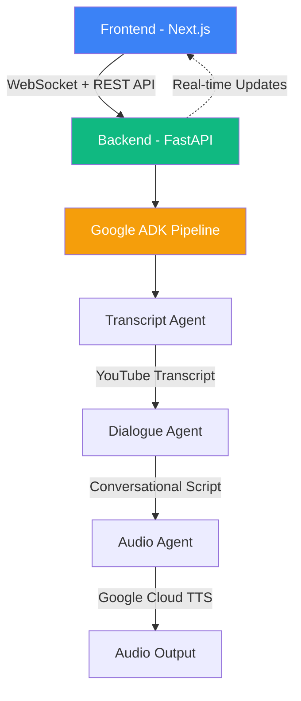
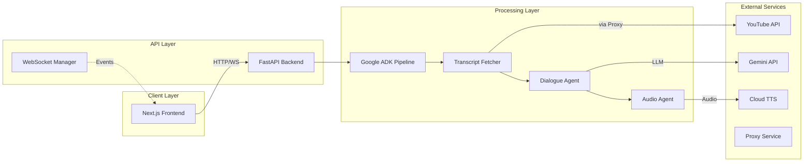
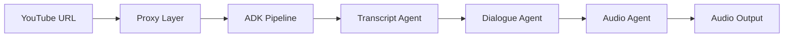

# 🎯 Phased Release Plan - Podcast Digest Agent

## Overview
This document outlines a comprehensive plan to prepare your Podcast Digest Agent for colleague review, incorporating code cleanup, restructuring, and professional documentation. It consolidates tasks from multiple PRDs into a single actionable plan.

## Current Status ✅
- **Functionality**: 100% working (proxy fixed, visualization fixed, audio improved)
- **Deployment**: Live on Vercel + Google Cloud Run
- **Code Quality**: 85% (some cleanup needed, ADK migration cleanup pending)
- **Structure**: Needs client/server reorganization
- **Documentation**: 60% (needs organization)
- **Portfolio Readiness**: 70% (needs professional documentation + code cleanup)

---

## 📋 Phase 1: Colleague Review Ready (4-5 hours)
**Goal**: Professional, well-structured codebase ready for technical colleague review  
**Timeline**: Today/Tomorrow
**Focus**: Project restructuring, code cleanup, and professional presentation

### 1.1 Project Restructuring - Client/Server Organization (1 hour)
Create a clear separation between frontend and backend code:

```bash
# Create new directory structure
mkdir -p client server
mkdir -p server/src

# Move frontend to client directory
mv client/* client/
mv client/.* client/ 2>/dev/null || true
rmdir client

# Move backend to server directory
mv src/* server/src/
mv src/.* server/src/ 2>/dev/null || true
rmdir src

# Move backend-specific files to server
mv requirements.txt dev-requirements.txt pyproject.toml start_server.py server/
mv *.py server/ 2>/dev/null || true  # Move any root Python files

# Keep in root: specs/, ai_docs/, .git/, .github/, docker files, etc.
# Root structure should now be:
# - client/          (all frontend code)
# - server/          (all backend code)
# - specs/           (all PRDs and specs)
# - ai_docs/         (AI context docs)
# - tests/           (keep in root for now)
# - Dockerfile, docker-compose.yml
# - .gitignore, .claude, .cursor, etc.
# - README.md, CLAUDE.md, other root docs

# Update imports in Python files
find server -name "*.py" -type f -exec sed -i '' 's/from src\./from server.src./g' {} +
find server -name "*.py" -type f -exec sed -i '' 's/import src\./import server.src./g' {} +

# Update test imports
find tests -name "*.py" -type f -exec sed -i '' 's/from src\./from server.src./g' {} +
find tests -name "*.py" -type f -exec sed -i '' 's/import src\./import server.src./g' {} +
```

### 1.2 ADK Migration Cleanup (45 min)
Remove deprecated code from the original pipeline implementation:

```bash
# Safety check - ensure nothing imports old code
grep -r "SimplePipeline" server/src/ --exclude-dir=__pycache__
grep -r "from src.agents" server/src/ --exclude-dir=__pycache__
grep -r "from src.runners" server/src/ --exclude-dir=__pycache__
grep -r "from server.src.agents" server/ --exclude-dir=__pycache__
grep -r "from server.src.runners" server/ --exclude-dir=__pycache__

# Remove deprecated directories (if safe)
rm -rf server/src/agents/        # Old agents replaced by ADK
rm -rf server/src/runners/       # Old pipeline runners  
rm -rf server/src/processing/    # Empty directory
rm -rf server/src/sessions/      # Unused directory

# Clean up API endpoints - remove commented imports in tasks.py
sed -i '' '/^# from src.runners.simple_pipeline/d' server/src/api/v1/endpoints/tasks.py
sed -i '' '/^# Deprecated function/,/^#     pass/d' server/src/api/v1/endpoints/tasks.py

# Remove test files for old implementation
rm -f tests/test_agents.py
rm -f tests/test_simple_pipeline.py
rm -f tests/agents/test_*.py  # Old agent tests

# Remove unused tool files (redundant with ADK)
rm -f server/src/tools/summarization_tools.py
rm -f server/src/tools/synthesis_tools.py
rm -f server/src/utils/audio_placeholder.py
rm -f server/src/utils/base_tool.py

# Clean up empty directories
find server/src -type d -empty -delete
```

**Impact**: ~3,000+ lines of code removed, significant reduction in maintenance burden

### 1.3 Code Quality & Formatting (30 min)
Setup and run code quality tools:

```bash
# Install Python linting tools if not already installed
pip install black ruff mypy pre-commit

# Backend formatting
cd server
black src/
ruff check src/ --fix
mypy src/ --ignore-missing-imports

# Frontend formatting  
cd ../client
npm install --save-dev prettier eslint @typescript-eslint/parser @typescript-eslint/eslint-plugin
npx prettier --write src/
npm run lint --fix

# Clean up cache and temp files
cd ..
find . -type d -name "__pycache__" -exec rm -rf {} +
find . -name ".DS_Store" -delete
rm -f *.log
rm -rf temp_analysis/
rm -rf test_output/
rm -rf test_chirp_output/

# Remove unused dependencies
cd server
sed -i '' '/litellm>=1.0.0/d' requirements.txt  # If not used
cd ../client
npm uninstall tw-animate-css  # If not used

# Set up pre-commit hooks
cd ..
cat > .pre-commit-config.yaml << 'EOF'
repos:
  - repo: https://github.com/pre-commit/pre-commit-hooks
    rev: v4.5.0
    hooks:
      - id: trailing-whitespace
      - id: end-of-file-fixer
      - id: check-yaml
      - id: check-added-large-files

  - repo: https://github.com/charliermarsh/ruff-pre-commit
    rev: 'v0.1.5'
    hooks:
      - id: ruff
        args: [--fix, --exit-non-zero-on-fix]

  - repo: https://github.com/psf/black
    rev: 23.10.1
    hooks:
      - id: black

  - repo: https://github.com/pre-commit/mirrors-mypy
    rev: v1.6.1
    hooks:
      - id: mypy
        files: ^server/src/
        args: [--ignore-missing-imports]
        additional_dependencies: [types-requests]
EOF

pre-commit install
pre-commit run --all-files
```

### 1.4 Remove One-off Test Scripts (15 min)
Clean up unnecessary test scripts and files:

```bash
# Remove one-off test scripts that are no longer needed
rm -f test_transcript.py
rm -f test_endpoint.py
rm -f test_chirp_voices.py
rm -f migration_validation.py
rm -f mock_successful_response.json

# Remove ADK research directory if no longer needed
rm -rf adk_research/

# Clean up any remaining test audio files
rm -rf audio/
rm -rf output_audio/
rm -rf input/
```

### 1.5 Update Configuration Files (15 min)
Ensure configuration files are updated for the new structure:

```bash
# Update pyproject.toml for new structure
cat >> server/pyproject.toml << 'EOF'

[tool.ruff]
line-length = 100
target-version = "py311"
select = ["E", "F", "B", "I", "N", "UP"]

[tool.black]
line-length = 100
target-version = ["py311"]

[tool.mypy]
python_version = "3.11"
warn_return_any = true
warn_unused_configs = true
EOF

# Update package.json scripts for new client location
cd client
npm pkg set scripts.lint="next lint"
npm pkg set scripts.format="prettier --write 'src/**/*.{ts,tsx,js,jsx,json,css,md}'"

# Update .gitignore for new structure
cd ..
echo "# Client specific" >> .gitignore
echo "client/node_modules/" >> .gitignore
echo "client/.next/" >> .gitignore
echo "client/out/" >> .gitignore
echo "" >> .gitignore
echo "# Server specific" >> .gitignore
echo "server/__pycache__/" >> .gitignore
echo "server/venv/" >> .gitignore
echo "server/.env" >> .gitignore
```

### 1.6 Comprehensive README Update (45 min)
Update README.md with professional documentation:

```markdown
# 🎙️ Podcast Digest Agent

Transform any YouTube video into an AI-powered conversational audio summary using Google's latest AI technologies.

🔗 **[Live Demo](https://podcast-digest-agent.vercel.app)**

## 🎯 Overview

Podcast Digest Agent is a full-stack application that leverages Google's Agent Development Kit (ADK) to create engaging audio summaries from YouTube videos. The system uses a pipeline of specialized AI agents to fetch transcripts, generate summaries, and produce natural conversational audio with dual voices.

## 🏗️ Architecture



## 🚀 Tech Stack

### Backend
- **FastAPI** - Modern async Python web framework
- **Google ADK v1.0.0** - Official Google Agent Development Kit
- **Gemini 2.0 Flash** - Google's latest LLM for fast inference
- **Google Cloud TTS** - Text-to-speech with Chirp HD voices
- **Pydantic v2** - Data validation and serialization

### Frontend  
- **Next.js 15** - React framework with App Router
- **TypeScript** - Type-safe development
- **shadcn/ui** - Modern UI components
- **TanStack Query** - Data fetching and caching
- **Motion.dev** - Smooth animations

### Infrastructure
- **Google Cloud Run** - Serverless container hosting
- **Vercel** - Frontend deployment with edge network
- **Webshare Proxy** - Reliable YouTube access at scale

## ✨ Key Features

- **Real-time Processing Visualization** - Watch AI agents work in real-time via WebSocket
- **Dual-Voice Conversations** - Natural dialogue between two AI hosts
- **Production Proxy System** - Reliable YouTube access with automatic rotation
- **Type-Safe Architecture** - Full TypeScript + Pydantic validation
- **Async Processing** - Concurrent audio generation for performance

## 🛠️ Installation & Setup

### Prerequisites
- Python 3.11+
- Node.js 18+
- Google Cloud account with APIs enabled
- Webshare proxy credentials (optional)

### Backend Setup
```bash
# Clone repository
git clone https://github.com/yourusername/podcast-digest-agent.git
cd podcast-digest-agent

# Navigate to server directory
cd server

# Create virtual environment
python -m venv venv
source venv/bin/activate  # Windows: venv\Scripts\activate

# Install dependencies
pip install -r requirements.txt

# Set up environment variables
cp .env.example .env
# Edit .env with your credentials

# Run backend
python src/main.py
```

### Frontend Setup
```bash
# From project root
cd client
npm install
npm run dev
```

## 🔧 Configuration

Create a `.env` file with:
```env
GOOGLE_API_KEY=your-gemini-api-key
GOOGLE_APPLICATION_CREDENTIALS=path/to/service-account.json
WEBSHARE_API_KEY=your-proxy-key  # Optional
```

## 📚 Documentation

- [Architecture Overview](docs/ARCHITECTURE.md)
- [API Documentation](docs/API.md)
- [ADK Integration Guide](docs/ADK_IMPLEMENTATION.md)
- [Deployment Guide](DEPLOYMENT_GUIDE.md)

## 🧪 Testing

```bash
# Backend tests
pytest tests/ --cov=src

# Frontend tests  
cd client
npm run test
```

## 🤝 Contributing

Contributions are welcome! Please read our contributing guidelines and submit PRs.

## 📄 License

MIT License - see LICENSE file for details
```

### 1.7 Testing & Verification (30 min)
Comprehensive testing after restructuring:

```bash
# Fix test imports for new structure
cd server
python -m pytest tests/ -v --tb=short

# Verify imports work correctly
python -c "from src.main import app; print('✅ Server imports working')"

# Test ADK imports
python -c "from src.adk_agents.podcast_agent import PodcastDigestAgent; print('✅ ADK imports working')"

# Start backend server
python src/main.py &
BACKEND_PID=$!

# Test API endpoints
sleep 5  # Wait for server to start
curl http://localhost:8000/api/v1/config
curl http://localhost:8000/docs  # Should show API documentation

# Start frontend
cd ../client
npm run dev &
FRONTEND_PID=$!

# Full integration test
echo "Visit http://localhost:3000 and test:"
echo "1. Paste a YouTube URL"
echo "2. Watch real-time processing visualization"
echo "3. Verify audio generation completes"
echo "4. Play the generated audio"

# Cleanup
kill $BACKEND_PID $FRONTEND_PID
```

### 1.8 Documentation Updates (15 min)
Update key documentation files for the new structure:

```bash
# Update CLAUDE.md with new structure
cat >> CLAUDE.md << 'EOF'

## New Project Structure (Client/Server)

The project has been reorganized into a clear client/server architecture:

- **client/**: All frontend code (formerly client/)
- **server/**: All backend code (formerly src/)
- **tests/**: Test files (kept in root)
- **specs/**: Project specifications and PRDs
- **docs/**: Architecture and API documentation

### Updated Commands

Backend development:
```bash
cd server
python src/main.py
```

Frontend development:
```bash
cd client
npm run dev
```
EOF

# Create docs/ARCHITECTURE.md with detailed diagrams
mkdir -p docs/assets
cat > docs/ARCHITECTURE.md << 'EOF'
# Architecture Overview

## System Design

The Podcast Digest Agent uses a microservices architecture with clear separation of concerns:

### Component Overview



### Data Flow

1. **Request Phase**: User submits YouTube URL
2. **Transcript Phase**: ADK fetches transcript via proxy  
3. **Processing Phase**: Gemini generates conversational summary
4. **Audio Phase**: Cloud TTS creates dual-voice audio
5. **Delivery Phase**: Audio URL returned to user

### Key Design Decisions

- **ADK Integration**: Leverages Google's official agent framework for reliability
- **Async Processing**: Non-blocking architecture for scalability
- **WebSocket Updates**: Real-time progress without polling
- **Proxy Rotation**: Ensures reliable YouTube access
- **Type Safety**: Pydantic + TypeScript for runtime validation
EOF
```

### 📍 Checkpoint 1: Colleague Review
**Share with colleagues**:
- GitHub repo with clean code and comprehensive README
- Live demo URL (optional): https://podcast-digest-agent.vercel.app
- Architecture documentation showing system design
- Clear setup instructions for local development

**What colleagues will see**:
- **Clean, modern codebase** using Google ADK
- **Professional documentation** with architecture diagrams
- **Clear code organization** following best practices
- **Type-safe implementation** with proper error handling
- **Production-ready patterns** (async, WebSocket, proxy handling)

---

## 📸 Phase 2: Portfolio Ready (4 hours)
**Goal**: Public portfolio presentation  
**Timeline**: After colleague feedback (1-2 days)

### 2.1 Visual Assets (1 hour)
```bash
# Create demo GIF showing:
# 1. Paste YouTube URL
# 2. Watch visualization progress
# 3. Play conversational audio

# Create architecture diagram
# Use draw.io or Mermaid to show:
# YouTube → Proxy → ADK Pipeline → Audio
```

### 2.2 Documentation Structure (1.5 hours)
```bash
# Create docs directory
mkdir -p docs/assets
mv *.md docs/  # Move PRDs to docs
touch docs/ARCHITECTURE.md
touch docs/API.md
```

**docs/ARCHITECTURE.md**:
```markdown
# Architecture Overview

## System Design
[Mermaid diagram showing data flow]

## ADK Agent Pipeline
1. **Transcript Agent**: Fetches YouTube content via proxy
2. **Dialogue Agent**: Creates conversational summary
3. **Audio Agent**: Generates dual-voice output

## Real-time Updates
WebSocket connection provides live progress updates
```

### 2.3 Frontend Polish (1 hour)
```typescript
// Add loading shimmer
// Add error boundaries
// Smooth animations
// Mobile responsive check
```

### 2.4 Portfolio README (30 min)
```markdown
# 🎙️ Podcast Digest Agent

> Transform any YouTube video into an engaging AI podcast summary in minutes

[](https://podcast-digest-agent.vercel.app)
[](docs/ARCHITECTURE.md)


## 🚀 What it does

Paste a YouTube URL, and get back a conversational audio summary featuring two AI hosts discussing the key points. Perfect for consuming long-form content on the go.

## 🏗️ Technical Highlights

- **Google ADK Integration**: Leverages Google's Agent Development Kit for robust AI pipelines
- **Production Proxy System**: Webshare integration ensures reliable YouTube access at scale  
- **Real-time Visualization**: WebSocket-powered progress tracking with particle animations
- **Type-Safe Architecture**: Full TypeScript + Pydantic with strict type checking
- **Cloud-Native Deployment**: Containerized on Cloud Run with automatic scaling

## 📊 Architecture



[See detailed architecture →](docs/ARCHITECTURE.md)
```

### 📍 Checkpoint 2: Portfolio Publication
**Publish to**:
- LinkedIn post with demo GIF
- Twitter/X thread with technical details
- Dev.to article (optional)
- Personal portfolio site

**Portfolio pitch**:
> "Built a full-stack AI application that transforms YouTube videos into conversational podcasts. Uses Google's ADK framework with production-grade proxy rotation and real-time WebSocket updates. Check out the live demo!"

---

## 🎯 Quick Decision Tree

```
Today: Working app deployed
  ↓
Clean up deprecated code (45 min)
  ↓
Run formatters & linters (30 min)
  ↓
Update README with architecture (45 min)
  ↓
✅ COLLEAGUE READY → Share for feedback
  ↓
[Get feedback, incorporate if quick]
  ↓
Create demo GIF + polish UI (2 hours)
  ↓
Update portfolio documentation (1 hour)
  ↓
✅ PORTFOLIO READY → Publish publicly
  ↓
[Ready for launch?]
  ↓
See LAUNCH_READY_ACTION_PLAN.md for:
- Rate limiting & cost protection
- Production deployment
- Launch marketing
```

## 🚫 What NOT to Do (For Now)

1. **Don't add rate limiting yet** - Focus on code quality first
2. **Don't add new features** - It works great as-is
3. **Don't over-document** - Keep it clear and concise
4. **Don't delay colleague review** - Get feedback early

## 📈 Success Metrics

### Phase 1 Success (Colleague Review):
- ✅ Clean, modern codebase with no deprecated code
- ✅ Professional README with clear architecture
- ✅ Easy local development setup
- ✅ All tests passing

### Phase 2 Success (Portfolio):
- ✅ Impressive demo GIF/video
- ✅ Clear value proposition
- ✅ Professional presentation
- ✅ Live demo accessible

---

## 🚀 Next Action (Right Now)

Execute these steps in order:

1. **Project Restructuring** (1 hour)
   - Run client/server reorganization commands from Phase 1.1
   - Update all imports to use new paths
   
2. **ADK Migration Cleanup** (45 min)
   - Remove deprecated code (check with grep first!)
   - Clean up ~3,000 lines of old implementation
   
3. **Code Quality** (30 min)
   - Run formatters: `black server/src/` and `npm run prettier`
   - Set up pre-commit hooks
   
4. **Cleanup Scripts** (30 min)
   - Remove one-off test scripts (Phase 1.4)
   - Update configuration files (Phase 1.5)
   
5. **Documentation** (1 hour)
   - Update README.md with the professional template
   - Create `docs/ARCHITECTURE.md`
   - Update CLAUDE.md
   
6. **Testing** (30 min)
   - Run all tests
   - Verify full pipeline works
   
7. **Share with colleagues** (15 min)
   - Push to GitHub
   - Send to 2-3 technical colleagues

Total time: **4-5 hours** to be colleague-ready!

## 📊 Summary of Changes

After completing Phase 1, your codebase will have:

### ✅ Structure Improvements
- Clear **client/** and **server/** separation
- Removed ~3,000 lines of deprecated code
- Professional directory organization
- Clean, consistent codebase

### ✅ Code Quality
- Pre-commit hooks configured
- All code formatted with Black/Prettier
- Type checking with MyPy
- Linting with Ruff/ESLint

### ✅ Documentation
- Professional README with architecture diagrams
- Comprehensive setup instructions
- Clear API documentation
- Mermaid diagrams showing system design

### ✅ Removed Files
- Old pipeline implementation (SimplePipeline, original agents)
- One-off test scripts
- Unused dependencies
- Empty directories

### 🎯 Ready for Colleagues
Your colleagues will see a **clean, modern, well-documented** codebase that demonstrates:
- Professional software engineering practices
- Clear architecture and design decisions
- Production-ready patterns
- Easy local development setup

## 📋 When You're Ready to Launch

See **[LAUNCH_READY_ACTION_PLAN.md](specs/LAUNCH_READY_ACTION_PLAN.md)** for:
- Adding rate limiting and cost protection
- Setting up Google Cloud budget alerts
- Deployment verification
- Creating launch content
- Long-term cost management

Remember: **Clean code > Perfect code** for colleague review! 🎯