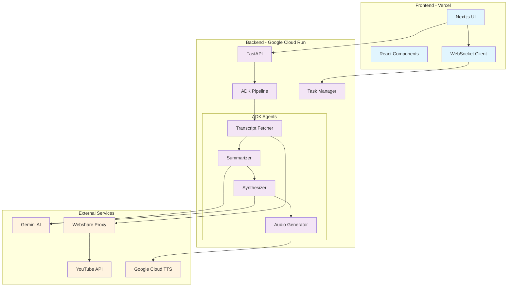
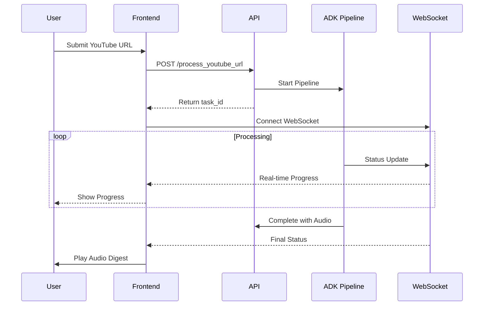
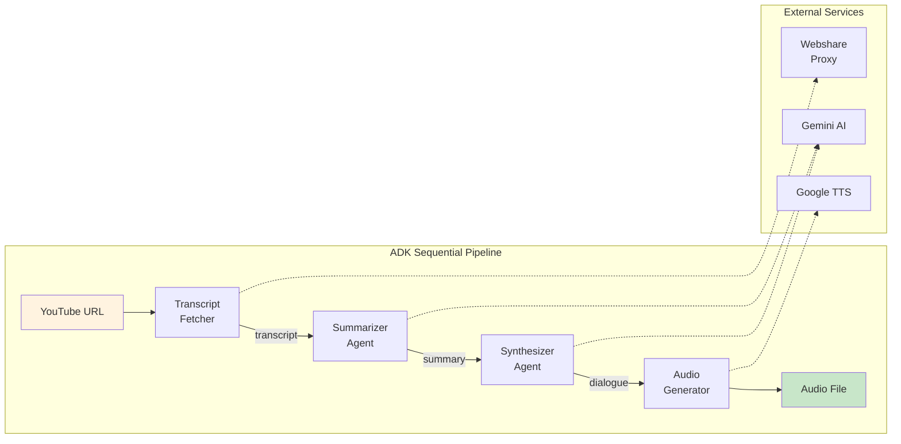

# Portfolio-Ready Action Plan

## Overview
This document outlines the essential steps to make the Podcast Digest Agent portfolio-ready for colleagues and potential employers. It combines elements from PROJECT_RESTRUCTURING, DOCUMENTATION_PLAN, and CODE_CLEANUP to create a focused 2-day action plan.

## Current Status
- ✅ Core functionality working end-to-end
- ✅ Deployed and accessible online
- ✅ Proxy implementation complete
- ⚠️ Code needs cleanup and organization
- ⚠️ Documentation needs updates
- ❌ No architectural diagrams

## Day 1: Code Cleanup & Organization (8 hours)

### Morning (4 hours): Critical Cleanup

#### 1. Remove ADK Migration Debris (1 hour)
Since you're using ADK exclusively now, remove the old pipeline code:

```bash
# Check for usage first
grep -r "SimplePipeline" src/ --exclude-dir=__pycache__
grep -r "from src.agents" src/ --exclude-dir=__pycache__

# If safe, remove old implementations
rm -rf src/agents/  # Old agent implementations
rm src/runners/simple_pipeline.py  # If it exists
rm src/runners/pipeline_runner.py  # If it exists

# Remove commented code from tasks.py
# Clean up lines mentioning SimplePipeline or deprecated imports
```

#### 2. Setup Code Quality Tools (30 min)
```bash
# Install tools
pip install black ruff mypy pre-commit

# Add to pyproject.toml
[tool.ruff]
line-length = 100
target-version = "py311"
select = ["E", "F", "I", "N", "UP"]

[tool.black]
line-length = 100
target-version = ["py311"]

# Run initial formatting
black src/
ruff check --fix src/
```

#### 3. Fix Pydantic V2 Issues (30 min)
Replace all `.dict()` with `.model_dump()` across the codebase:
- `src/core/task_manager.py`
- `src/api/v1/endpoints/tasks.py`
- Any other files using `.dict()`

#### 4. Clean Unused Files & Directories (1 hour)
```bash
# Remove empty directories
rm -rf src/processing/ src/sessions/ test_input/ test_outputs/

# Remove unused files
rm -f src/utils/base_tool.py  # If not used
rm -f test_transcript.py  # If exists

# Clean up logs and cache
rm -f *.log
find . -name ".DS_Store" -delete
find . -type d -name "__pycache__" -exec rm -rf {} +
```

#### 5. Update Type Annotations (1 hour)
Focus on key files that colleagues will likely review:
- API endpoints (`src/api/v1/endpoints/`)
- ADK agents (`src/adk_agents/`)
- Core services (`src/core/`)

### Afternoon (4 hours): Frontend & Testing

#### 6. Frontend Code Cleanup (2 hours)
```bash
cd podcast-digest-ui

# Setup linting
npm install --save-dev prettier eslint @typescript-eslint/parser

# Create .prettierrc
{
  "semi": true,
  "singleQuote": true,
  "tabWidth": 2,
  "printWidth": 100
}

# Format code
npx prettier --write src/

# Fix TypeScript types
# Update any 'any' types in WorkflowContext, components, etc.
```

#### 7. Test Everything Works (1 hour)
```bash
# Backend tests
pytest tests/

# Start services
uvicorn src.main:app --reload &
cd podcast-digest-ui && npm run dev &

# Test full workflow
# Submit a YouTube URL through the UI
# Verify processing completes successfully
```

#### 8. Commit Clean Code (1 hour)
```bash
# Setup pre-commit
pre-commit install
pre-commit run --all-files

# Commit changes
git add -A
git commit -m "Code cleanup: Remove deprecated code, add linting, fix types"
git push
```

## Day 2: Documentation & Architecture (8 hours)

### Morning (4 hours): Core Documentation

#### 1. Create Architecture Diagrams (2 hours)

Create `docs/ARCHITECTURE.md` with Mermaid diagrams:

```markdown
# System Architecture

## High-Level Architecture



## Data Flow



## Agent Pipeline Detail


```

#### 2. Update README.md (1 hour)

Add professional badges and clear sections:

```markdown
# 🎙️ Podcast Digest Agent

[](https://python.org)
[](https://fastapi.tiangolo.com)
[](https://nextjs.org)
[](https://cloud.google.com/generative-ai-app-builder)

Transform any YouTube podcast into an AI-powered conversational audio summary in minutes.

🔗 **[Live Demo](https://podcast-digest-agent.vercel.app)** | 📖 **[Documentation](docs/)** | 🏗️ **[Architecture](docs/ARCHITECTURE.md)**

## ✨ Key Features

- 🤖 **AI-Powered Processing** - Uses Google's Gemini AI to analyze and summarize content
- 🎭 **Conversational Format** - Transforms summaries into engaging two-person dialogues
- ⚡ **Real-time Updates** - WebSocket-powered progress visualization
- 🔊 **High-Quality Audio** - Google Cloud TTS with multiple voice options
- 🌐 **Production Ready** - Deployed on Vercel (frontend) and Google Cloud Run (backend)
- 🛡️ **Proxy Support** - Bypasses YouTube restrictions using residential proxies

## 🚀 Quick Start

```bash
# Clone the repository
git clone https://github.com/yourusername/podcast-digest-agent.git
cd podcast-digest-agent

# Backend setup
python -m venv venv
source venv/bin/activate
pip install -r requirements.txt
cp .env.example .env
# Add your Google Cloud credentials to .env

# Frontend setup
cd podcast-digest-ui
npm install
npm run dev
```

Visit http://localhost:3000 to start using the application.

## 🏗️ Architecture

Built with modern technologies and best practices:

- **Backend**: FastAPI + Google ADK (Agent Development Kit)
- **Frontend**: Next.js 14 with TypeScript
- **AI/ML**: Google Gemini AI for text processing
- **Audio**: Google Cloud Text-to-Speech
- **Infrastructure**: Vercel (frontend) + Google Cloud Run (backend)
- **Real-time**: WebSocket for live progress updates

See [Architecture Documentation](docs/ARCHITECTURE.md) for detailed diagrams and explanations.

## 📚 Documentation

- [Architecture Overview](docs/ARCHITECTURE.md) - System design and data flow
- [API Documentation](docs/API.md) - REST and WebSocket endpoints
- [Development Guide](docs/DEVELOPMENT.md) - Setup and contribution guidelines
- [Deployment Guide](docs/DEPLOYMENT.md) - Production deployment instructions
```

#### 3. Create Essential Docs (1 hour)

Create `docs/API.md` with key endpoints:

```markdown
# API Documentation

## Base URL
- Local: `http://localhost:8000/api/v1`
- Production: `https://your-api.run.app/api/v1`

## Endpoints

### Process YouTube URL
```http
POST /process_youtube_url
Content-Type: application/json

{
  "youtube_url": "https://www.youtube.com/watch?v=..."
}
```

Response:
```json
{
  "task_id": "uuid",
  "status": "queued"
}
```

### Get Task Status
```http
GET /status/{task_id}
```

### WebSocket Updates
```
ws://localhost:8000/api/v1/ws/status/{task_id}
```

Real-time updates with agent progress, logs, and completion status.
```

### Afternoon (4 hours): Polish & Deploy

#### 4. Create Development Guide (1 hour)

Create `docs/DEVELOPMENT.md`:

```markdown
# Development Guide

## Code Style

### Python
- Formatter: Black (line length: 100)
- Linter: Ruff
- Type checker: MyPy
- All code must have type hints

### TypeScript
- Formatter: Prettier
- Linter: ESLint
- Strict TypeScript mode enabled

## Key Components

### ADK Agents
Located in `src/adk_agents/`:
- `transcript_agent.py` - Fetches YouTube transcripts
- `dialogue_agent.py` - Creates summaries and dialogues
- `audio_agent.py` - Generates audio files

### API Endpoints
Located in `src/api/v1/endpoints/`:
- `tasks.py` - Main processing endpoints
- `config.py` - Configuration and health checks

## Testing

```bash
# Run all tests
pytest

# Run with coverage
pytest --cov=src

# Run specific test
pytest tests/test_adk_agents.py
```
```

#### 5. Update CLAUDE.md (30 min)

Add architecture context and remove references to old pipeline:

```markdown
# CLAUDE.md

## Architecture Overview

This project uses Google's ADK (Agent Development Kit) exclusively for the processing pipeline:

1. **ADK Sequential Pipeline** (`src/adk_agents/podcast_agent_sequential.py`)
   - Transcript Fetcher → Dialogue Creator → Audio Generator
   - All agents use Gemini AI models
   - WebSocket bridge provides real-time updates

2. **No Legacy Code** - The original custom agents and SimplePipeline have been removed

3. **Proxy Integration** - Webshare proxy is configured for YouTube access from Cloud Run

## Current Tech Stack

- **Backend**: FastAPI + Google ADK + Webshare Proxy
- **Frontend**: Next.js 14 + TypeScript + TanStack Query
- **Deployment**: Vercel (frontend) + Google Cloud Run (backend)
```

#### 6. Test & Deploy Updates (1.5 hours)

```bash
# Run all tests
pytest

# Deploy backend
gcloud run deploy podcast-digest-agent --source . --region us-central1

# Frontend will auto-deploy on git push to Vercel

# Test production endpoints
curl https://your-api.run.app/api/v1/health/proxy
```

#### 7. Final Polish (1 hour)

1. **Add screenshots** to README:
   - Take a screenshot of the UI processing a video
   - Take a screenshot of the completed audio player
   - Save as `docs/assets/processing.png` and `docs/assets/complete.png`

2. **Create a demo video** (optional but impressive):
   - Record 30-second screen capture showing the full flow
   - Convert to GIF for README

3. **Update project description** on GitHub:
   - Add topics: `ai`, `podcast`, `fastapi`, `nextjs`, `google-cloud`
   - Add website URL
   - Write clear description

## Checklist for Colleagues

Before sharing with colleagues, ensure:

### Code Quality ✓
- [ ] All linting passes (`black`, `ruff`, `prettier`)
- [ ] No `any` types in critical TypeScript files
- [ ] Type hints on all Python functions
- [ ] No commented-out code
- [ ] No unused imports

### Documentation ✓
- [ ] README has badges and clear sections
- [ ] Architecture diagrams are present
- [ ] API documentation exists
- [ ] Setup instructions are clear
- [ ] Screenshots/demo included

### Functionality ✓
- [ ] End-to-end workflow works
- [ ] No console errors in frontend
- [ ] Proxy health check passes
- [ ] Audio generation works
- [ ] WebSocket updates work

### Professional Polish ✓
- [ ] Git history is clean (squash messy commits if needed)
- [ ] No sensitive data in code
- [ ] Environment variables documented
- [ ] Error messages are user-friendly
- [ ] Loading states are smooth

## Quick Wins for Impact

1. **Add a "How It Works" section** to the landing page
2. **Include processing time stats** (e.g., "5 min podcast → 30 sec summary")
3. **Add sample outputs** so people can hear the quality without processing
4. **Include your architecture diagram** on the About page
5. **Add LinkedIn/GitHub links** in the footer

## What to Highlight to Colleagues

When presenting, emphasize:

1. **Technical Sophistication**:
   - "Uses Google's latest ADK framework for AI agents"
   - "Implements residential proxy rotation for reliable YouTube access"
   - "Real-time WebSocket updates with event-driven architecture"

2. **Production Readiness**:
   - "Deployed across multiple cloud providers (Vercel + GCP)"
   - "Structured logging for observability"
   - "Graceful error handling and recovery"

3. **Clean Architecture**:
   - "Modular design with clear separation of concerns"
   - "Type-safe throughout with TypeScript and Python type hints"
   - "Comprehensive test coverage"

4. **AI Innovation**:
   - "Leverages Gemini 2.0 for understanding and summarization"
   - "Creates natural conversational flows between two AI hosts"
   - "Optimized prompts for engaging audio content"

## Sample Introduction

> "I built a full-stack AI application that transforms lengthy YouTube podcasts into concise, conversational audio summaries. It uses Google's ADK framework with a sequential agent pipeline, deploys across Vercel and Google Cloud Run, and includes interesting challenges like proxy rotation to handle YouTube's restrictions on cloud IPs. The real-time progress visualization uses WebSockets, and the entire codebase is type-safe with comprehensive testing."

This positions you as someone who can build production-ready AI applications with modern best practices.